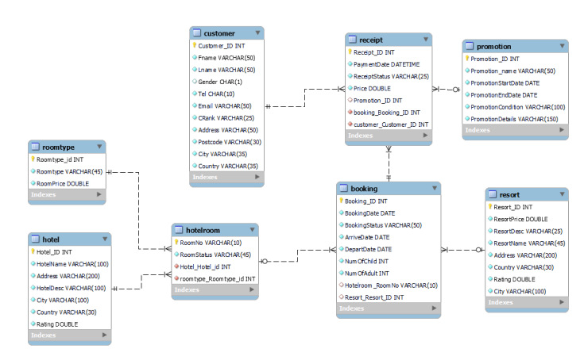

# Scrollatravel
## เป็น Project ที่ทำในตอนเรียนปีที่ 2 เทอมที่ 1 
เป็น Project ที่จับกลุ่มกับเพื่อน 4 คน โดยช่วยกันออกเเบบ DataBase เเละ ออกเเบบ Business Requirements 
โดยที่กลุ่มผมเลือกคือตัวของ Scrollatravel หรือ Database ไว้ในการจองโรงแรม เเละ เช้าที่พักอาศัย
 
## Business Requirements
### User :
ผู้ใช้งานแบ่งออกเป็น 2 กลุ่ม ได้แก่  
▪ ผู้เช่าที่พักอาศัย  
▪ เจ้าของโรงแรม เเละ ผู้ปล่อยที่พักอาศัยให้เช่า  
### Features :
1. ผู้เช่าที่พักอาศัยสามารถเลือกได้ว่า จะเลือกพักโรงแรม หรือบ้านที่มีผู้ปล่อยที่พักอาศัยให้เช่า
2. ผู้ปล่อยที่พักอาศัยให้เช่าและผู้มาพักอาศัยสามารถระบุข้อมูลส่วนตัวของตัวเองได้
3. ผู้เช่าที่พักอาศัยสามารถจองที่พักอาศัยได้ล่วงหน้า และสามารถยกเลิกการจองได้
โดยมีกฎว่าหลังจากชำระเงินแล้วต้องการที่จะยกเลิกการจอง จะได้รับเงินคืนเพียง 80%
4.มีการให้คะเเนนเเก่ผู้ปล่อยที่พักอาศัยเเละผู้เช่าที่พักอาศัยเพ่ือสร้างความน่าเชื่อถือเเละยิ่งมี
คะเเนนมากจะมี Rating สูง
5. ผู้ที่ปล่อยให้เช่าหรือโรงเเรมสามารถซื้อโฆษณาในเเอพให้ขึ้นหน้าเเรกๆได้เเต่ต้องผ่าน
การตรวจสอบของเเอปพลิเคชั่นของเราก่อนโดยการที่ต้องไปลงพื้นที่จริง
6. ฝ่ายผู้เช่าที่พักอาศัยยิ่งมี rank สูงจะมีสิทธิพิเศษในการลดค่าใช้จ่ายของที่พักอาศัย
### Benefits :
1. ความปลอดภัยในการชำระเงินเเละความสบายใจของทั้งผู้เช่ากับผู้อาศัย
2. ผู้เช่าที่พักอาศัยนั้นสามารถกรอกข้อมูลเเค่ครั้งเดียวพอ ทำให้ประหยัดเวลา
3. ความสะดวกสบายในการจองไม่มีความยุ่งยาก
4. ทางตัวของ ผู้ใช้งาน ทั้งฝั่งผู้มาพักอาศัยเเละผู้ปล่อยที่พักอาศัยให้เช่า
มีโปรโมชั่นต่างๆ ตามข้อตกลงในแอปเรา
5. มีการให้บริการด้านความสะดวกสบายภายในเเอป ทำให้ ผู้ใช้งาน ไม่ต้องใช้เเอปอื่น
6. ผู้ปล่อยที่พักไม่ต้องเสียเวลาในการดำเนินเอกสารต่างๆ หรือหาข้อมูลเกี่ยวกับความน่าเชื่อถือของตัวผู้มาพักอาศัย
7. สามารถค้นหาโรงแรมและตรวจสอบห้องว่างได้แบบทัน
 
logical DB Design (Table Design)

